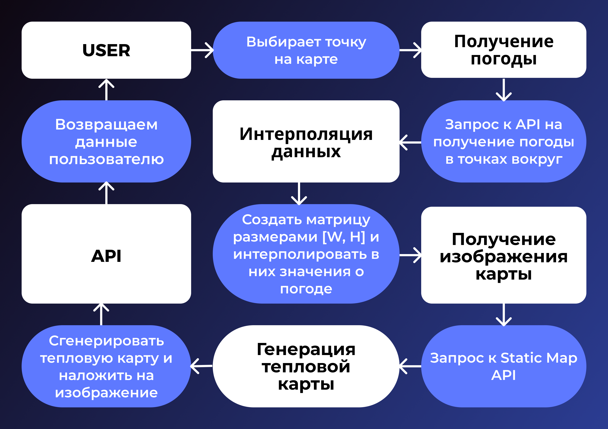

# Тепловая карта погоды


## Задача:
Построить тепловую карту температуры воздуха вокруг указанного города.

## Запуск
```bash
python3 -m venv .venv
source ./.venv/bin/activate

pip install -r requirements.txt

# Запуск сервера
# uvicorn main:app --host 0.0.0.0 --port 8080 --reload # запуск у меня на виртуалке через проброс порта
uvicorn main:app --reload
```
## Context Diagram


## Use Case Diagram

## Sequence Diagram

## Component Diagram

## Диаграмма сущностей